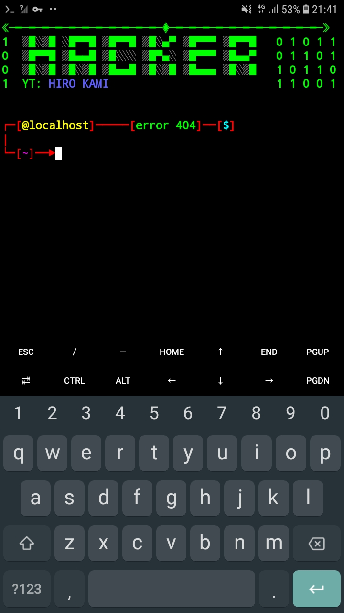

# temux_style

   
<b>INTRODUÇÃO: </b>Esse script foi criado para personalizar o PS1(bash) e o banner do terminal, especificamente o termux

   

   
<b>MODO DE USO: </b>Depois de ter feito á instalação basta <b>reiniciar</b> o terminal

## Instalação
* `git clone https://github.com/H1R0Z1N/termux_style`
* `cd termux_style`
* `bash instalar.sh`

## print do banner
</img>

## Créditos

YouTube: <a href="https://youtube.com/channel/UCeYIzzzMCs-RVI8BJpG3KGg"> HIRO KAMI</a>

Instagram: <a href="https://instagram.com/the_hiro_kami?igshid=NDc0ODY0MjQ=">@the_hiro_kami</a>

Git hub: <a href="https://github.com/H1R0Z1N">H1R0Z1N</a>

